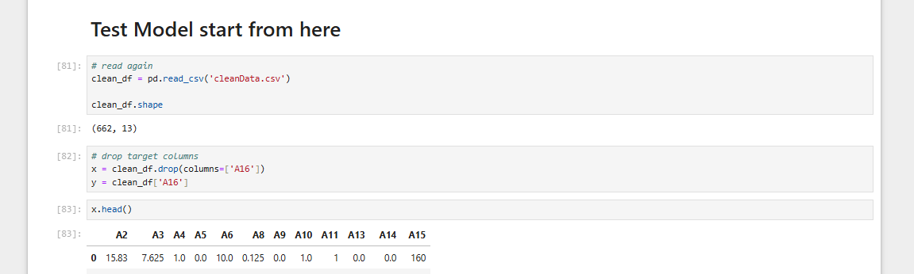

# Credit Approval - Data Science Assignment
Data Science Assignment about how to clean, prepare and create model using 5 different algorithm

# Requirement 
``` 
ucimlrepo
pandas
numpy
matplotlib
seaborn
scikit-learn
scipy
joblib
```

# Model
1. Support Vector Classification (yixuan)
2. Random Forest Classification (fungqi)
3. Logistic Regression (xinjie)
4. K Nearest Neighbourhood (shanyi)
5. Xgboost Classification (janice)

# Step to Try your own model
1. Open New CreditApproval Process.ipynb file 
2. Run the Package installation step
3. Run Import Library step
4. Find a header called Test Model start from here, execute all the step below it 

5. Start to test your model by using <code>rescaledX_test</code>, <code>rescaledX_train</code>, <code>y_test</code>, <code>y_train</code>
